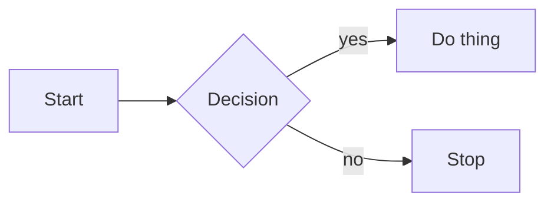

# MD WYSIWYG sample fixture

This file exercises every construct the extension will support. Use it as the
smoke test during every phase.

## Inline formatting

Paragraphs can have **bold**, *italic*, _also italic_, ~~strikethrough~~, and
`inline code`. A [link to example](https://example.com) and an autolink
<https://example.com>.

## Headings

# H1
## H2
### H3
#### H4
##### H5
###### H6

## Lists

- bullet one
- bullet two
  - nested
- bullet three

1. ordered one
2. ordered two
3. ordered three

- [ ] task open
- [x] task done
- [ ] another open task

## Blockquote

> Single-line blockquote.
>
> Second paragraph in the same blockquote.

## Horizontal rule

---

## Fenced code

```ts
function greet(name: string): string {
  return `Hello, ${name}`;
}
```

## GFM table

| Column A | Column B | Column C |
| -------- | :------: | -------: |
| a1       |    b1    |       c1 |
| a2       |    b2    |       c2 |

## Math

Inline: $E = mc^2$ and $a^2 + b^2 = c^2$.

Block:

$$
\int_0^1 x^2 \, dx = \frac{1}{3}
$$

## Mermaid



## Image


